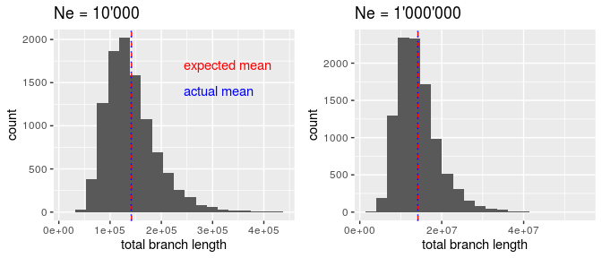
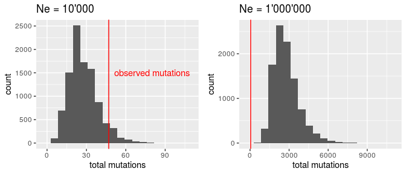
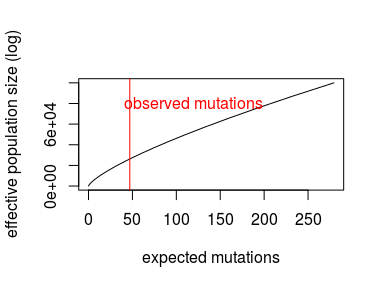
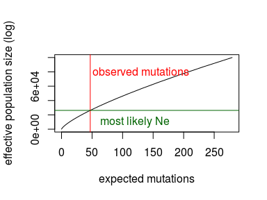
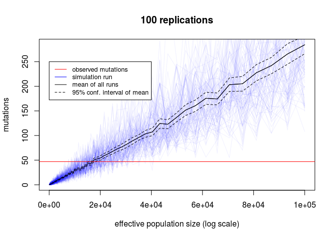
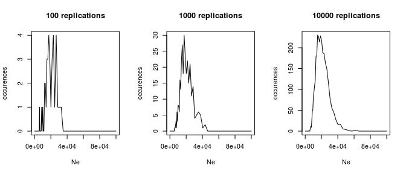

Estimating effective population sizes with coalescent simulations
================

## Simulating segregating sites

Coalescent simulations are used to obtain the theoretical distribution
of segregating sites, as a function of the population size. Assumed is
that mutations follow a poisson distribution, with parameter the product
of the total branch length, the mutation rate per site per generation,
and the sequence length. The distribution is compared to data by [Enard
et al. (2002)](https://www.nature.com/articles/nature01025), with the
final goal of determining which simulated population size best fits the
observed data. Libraries used: `ggplot2, gridExtra, ODS`

Given is the following data:

``` r
n <- 20         # sample size: 20 humans
bp.obs <- 14063 # base pairs analyzed
s.obs <- 47     # segregating sites observed
m <- 1.4*10^-8  # mutation rate
```

Total branch length and mutations can be simulated as a function of
effective population size (`Ne`) and sample size (`n`)

``` r
sim_coalescence<- function(Ne,n){
  time <- 0
  mutations <- 0
  probs <- choose(20:2,2)*1/(2*Ne) #probability that two lines coalesc in diploid organisms
  i <- 20
  for (prob in probs){
    time <- time + rgeom(1,prob)*i #take random sample of a geometric distr.
    i <- i-1
  }
  mutations <- rpois(1,time*m*bp.obs) #mutations follow a poisson distribution
  return(cbind(time,mutations)) #returns total branch length and mutations 
}
```

Similarly the expected coalescensce times can be calculated

``` r
exp_coalescence <- function(Ne,n){
  time <- 0
  for (i in 2:n-1){ 
    time <- time + 1/i
  }
  return(time*4*Ne)
}
```

## Compare two population sizes

For now lets just test how well two hypotheses about the effective
population sites match the observed data other: \(H_a\): `Ne` = 10’000,
\(H_b\): `Ne` = 1’000’000.

``` r
Ne_a <- 10000
Ne_b <- 1000000
Nb_simulations <- 10000
sim_a <- replicate(Nb_simulations, sim_coalescence(Ne_a, n), simplify=TRUE)
sim_b <- replicate(Nb_simulations, sim_coalescence(Ne_b, n), simplify=TRUE)
```

Plot the distribution of simulations, the means and expected theoretical
values in a histogram.
<!-- -->

-----

Lets look how they fit to our
data:

<!-- -->

The effective population size of 10’000 seems to fit our observed
mutations better.

-----

Lets approximate the likelihood of both hypotheses to quantify our
observation. Calculate the ratio of the simulations with the same amount
of mutations we
observed:

``` r
length(tot_mutations_a[tot_mutations_a == s.obs])/length(tot_mutations_a)
```

    ## [1] 0.0072

``` r
length(tot_mutations_b[tot_mutations_b == s.obs])/length(tot_mutations_b)
```

    ## [1] 0

The likelihood of H\_a is higher (69 simulations of 10’000 with exactly
47 mutations) than H\_b (0 simulations of 10’000 with exactly 47
mutations). From the plots above we can also see that H\_a does not seem
to be the optimum. We can further improve our
model.

## Approximating most likely effective population size with expectation values

Lets find the theoretical
optimum:

<!-- -->

``` r
approx = approxfun(muts, logspace(2,5,50))
intersect <- approx(s.obs)
intersect
```

    ## [1] 26245.28

This is our approximated optimum.
Plotted:

<!-- -->

## Approximating most likely effective population size with simulations

Do a hyperparameter search for logarithmically spaced values of Ne. With
100 replications and 100 parameters (`logspace(2,5,100)`) tested we get
the following distribution:
<!-- -->

Or as function of likelihood as calculated
above:

<!-- -->

The peak maximum likelihood becomes more and more certain with
increasing replications. Lets check it for `Ne`=10’000:

``` r
logspace(2,5,resolution)[which.max(occurences)]
```

    ## [1] 15199.11

This is the value of `Ne` which lead to the best result in this
simulation run. Keep in mind that we only simulated 100 different values
of `Ne`, which is a coarse resolution.
